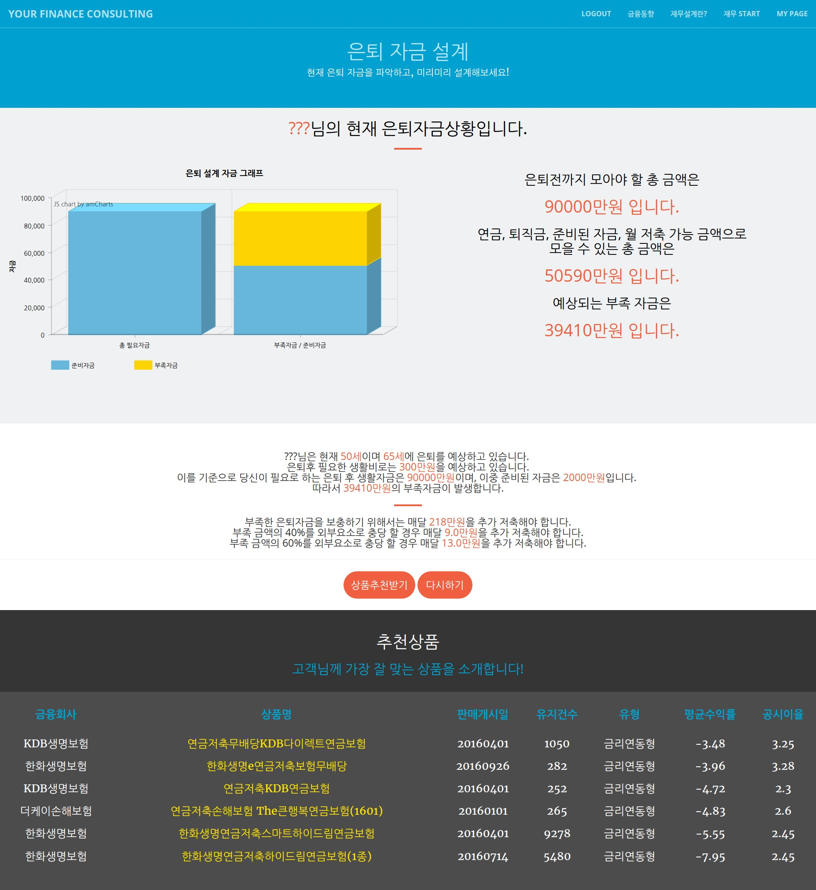
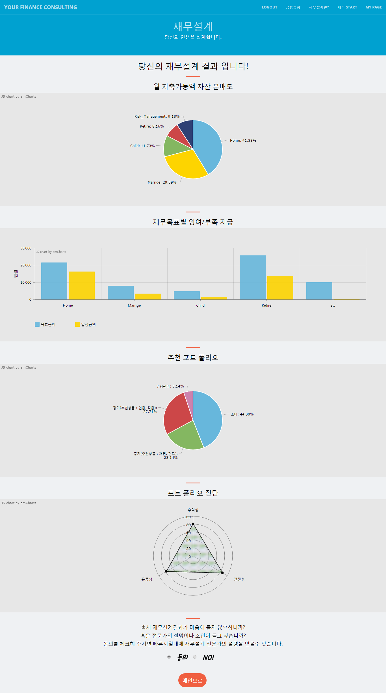

# Robo-Advisor
Machine-Learning based robo-advisor
 
- Spring framework 
- Java+Jsp+Mybatis 
- Oracle 11g 
- R serve

## Main Functions
- Financial planning
- House-Price Prediction by Arima and Forcast in R
- Financial-Products Recommendation by UBCF(User-based Collaborative Filtering) in R

  

## 1. Main page

 

## 2. Retirement fund design

 

## 3. Residential fund design

 

## 4. Result of Financial planning

